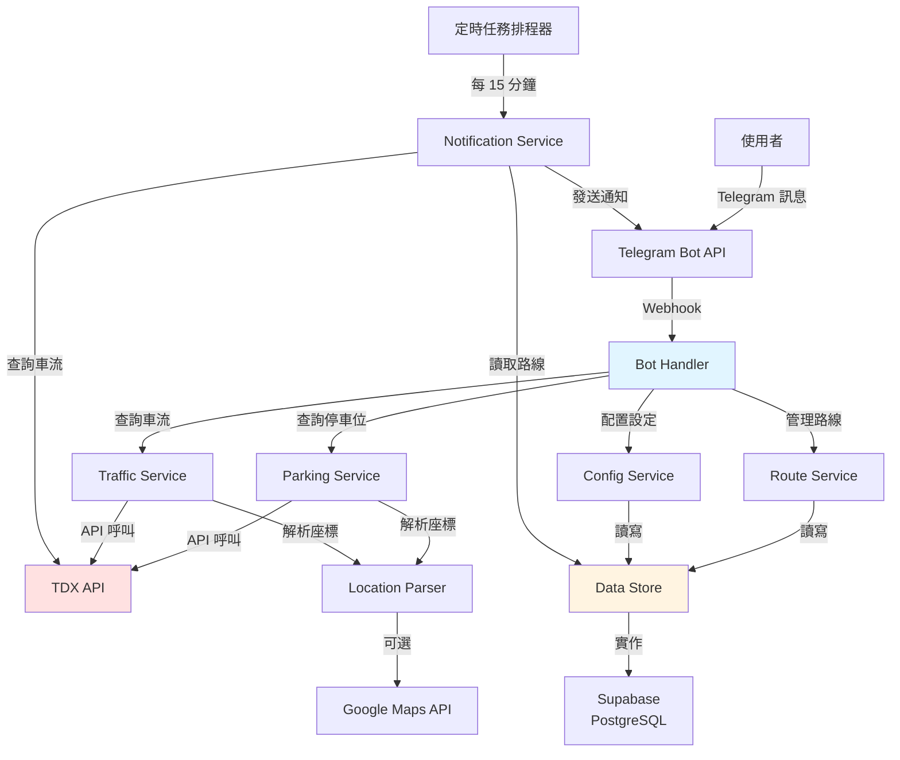
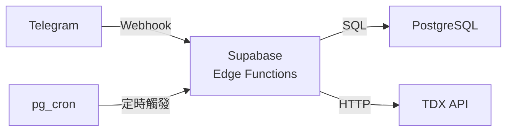

# Design Document: Telegram Parking Bot

## Overview

本設計文件描述一個整合台灣交通部 TDX API 的 Telegram Bot 系統，提供即時停車位查詢、車流資訊查詢及主動推播通知功能。系統採用無伺服器架構，支援零維運成本部署，並允許使用者自行配置 API 金鑰和後端服務。

### 核心功能

1. **停車位查詢**：基於當前位置或目的地搜尋附近停車場和路邊停車位
2. **車流查詢**：查詢特定路線的即時車流狀況和交通事故
3. **經常性路線管理**：設定常用路線並接收異常通知
4. **主動推播**：監控經常性路線並在發生異常時主動通知使用者
5. **自助配置**：使用者可自行配置 TDX API 金鑰和後端服務

### 設計目標

- **零維運成本**：使用免費服務（Telegram Bot API、Supabase 免費方案）
- **易於部署**：提供完整的自助配置流程和部署指南
- **可靠性**：完善的錯誤處理和重試機制
- **使用者友善**：直覺的對話式介面和清晰的資訊呈現
- **資料隔離**：多使用者環境下確保資料和 API 金鑰的隔離

## Architecture

### 系統架構圖



### 架構層級

#### 1. 介面層 (Interface Layer)
- **Telegram Bot API**：接收使用者訊息和發送回應
- **Webhook Handler**：處理 Telegram 的 webhook 請求

#### 2. 應用層 (Application Layer)
- **Bot Handler**：訊息路由和指令處理
- **Parking Service**：停車位查詢邏輯
- **Traffic Service**：車流查詢邏輯
- **Route Service**：經常性路線管理
- **Config Service**：使用者配置管理
- **Notification Service**：主動推播邏輯

#### 3. 整合層 (Integration Layer)
- **TDX API Client**：封裝 TDX API 呼叫
- **Location Parser**：解析各種位置輸入格式
- **Maps API Client**：可選的 Google Maps API 整合

#### 4. 資料層 (Data Layer)
- **Data Store**：持久化儲存（Supabase PostgreSQL）
- **Cache Layer**：API 回應快取（5 分鐘）

### 部署架構

#### Supabase 部署架構


## Components and Interfaces

### 1. Bot Handler

**職責**：接收和路由 Telegram 訊息，處理指令和回應使用者

**介面**：
```typescript
interface BotHandler {
  // 處理 webhook 請求
  handleWebhook(request: WebhookRequest): Promise<void>
  
  // 處理指令
  handleCommand(chatId: string, command: string, args: string[]): Promise<void>
  
  // 處理位置訊息
  handleLocation(chatId: string, location: Location): Promise<void>
  
  // 處理回調查詢（inline keyboard）
  handleCallback(chatId: string, callbackData: string): Promise<void>
  
  // 發送訊息
  sendMessage(chatId: string, text: string, options?: MessageOptions): Promise<void>
}
```

**支援的指令**：
- `/start` - 顯示歡迎訊息和功能選單
- `/help` - 顯示指令說明
- `/parking` - 啟動停車位搜尋
- `/traffic` - 啟動車流查詢
- `/routes` - 管理經常性路線
- `/setup` - 初始配置流程
- `/config` - 查看當前配置
- `/reset` - 重新配置

### 2. Parking Service

**職責**：處理停車位查詢邏輯

**介面**：
```typescript
interface ParkingService {
  // 搜尋附近停車位
  searchNearby(
    location: Coordinates,
    radius: SearchRadius,
    apiKey: string
  ): Promise<ParkingFacility[]>
  
  // 格式化停車位資訊
  formatParkingInfo(facilities: ParkingFacility[]): string
  
  // 產生導航連結
  generateNavigationLink(facility: ParkingFacility): string
}

type SearchRadius = 500 | 1000 | 2000 // 單位：公尺

interface ParkingFacility {
  id: string
  name: string
  address: string
  location: Coordinates
  totalSpaces: number
  availableSpaces: number
  fee: string
  distance: number // 單位：公尺
  type: 'parking_lot' | 'street_parking'
}
```

### 3. Traffic Service

**職責**：處理車流查詢邏輯

**介面**：
```typescript
interface TrafficService {
  // 查詢路線車流
  queryRouteTraffic(
    route: Route,
    apiKey: string
  ): Promise<TrafficInfo>
  
  // 查詢交通事故
  queryTrafficEvents(
    route: Route,
    apiKey: string
  ): Promise<TrafficEvent[]>
  
  // 格式化車流資訊
  formatTrafficInfo(info: TrafficInfo, events: TrafficEvent[]): string
}

interface Route {
  origin: Coordinates
  destination: Coordinates
  waypoints?: Coordinates[]
}

interface TrafficInfo {
  status: 'smooth' | 'congested' | 'heavy_congestion'
  estimatedDuration: number // 單位：分鐘
  distance: number // 單位：公里
}

interface TrafficEvent {
  id: string
  type: 'accident' | 'construction' | 'congestion'
  location: Coordinates
  description: string
  estimatedImpact: number // 單位：分鐘
  startTime: Date
}
```

### 4. Route Service

**職責**：管理使用者的經常性路線

**介面**：
```typescript
interface RouteService {
  // 新增經常性路線
  addRoutineRoute(
    userId: string,
    route: RoutineRoute
  ): Promise<void>
  
  // 取得使用者的所有路線
  getRoutineRoutes(userId: string): Promise<RoutineRoute[]>
  
  // 刪除路線
  deleteRoutineRoute(userId: string, routeId: string): Promise<void>
  
  // 更新路線名稱
  updateRouteName(
    userId: string,
    routeId: string,
    newName: string
  ): Promise<void>
}

interface RoutineRoute {
  id: string
  userId: string
  name: string
  origin: Coordinates
  destination: Coordinates
  createdAt: Date
  notificationPreferences?: NotificationPreferences
}

interface NotificationPreferences {
  enabled: boolean
  timeRanges?: TimeRange[] // 可選的通知時段
}

interface TimeRange {
  startHour: number // 0-23
  endHour: number // 0-23
}
```

### 5. Notification Service

**職責**：監控經常性路線並發送主動通知

**介面**：
```typescript
interface NotificationService {
  // 執行監控任務（由定時排程器呼叫）
  runMonitoringTask(): Promise<void>
  
  // 檢查單一路線
  checkRoute(route: RoutineRoute, apiKey: string): Promise<void>
  
  // 判斷是否需要通知
  shouldNotify(
    currentTraffic: TrafficInfo,
    events: TrafficEvent[],
    lastNotification?: NotificationRecord
  ): boolean
  
  // 發送通知
  sendNotification(
    userId: string,
    route: RoutineRoute,
    traffic: TrafficInfo,
    events: TrafficEvent[]
  ): Promise<void>
}

interface NotificationRecord {
  routeId: string
  userId: string
  sentAt: Date
  eventIds: string[] // 已通知的事件 ID
}
```

### 6. Config Service

**職責**：管理使用者配置

**介面**：
```typescript
interface ConfigService {
  // 檢查使用者是否已配置
  isConfigured(userId: string): Promise<boolean>
  
  // 儲存 TDX API 金鑰
  saveTdxApiKey(userId: string, apiKey: string): Promise<void>
  
  // 取得 TDX API 金鑰
  getTdxApiKey(userId: string): Promise<string | null>
  
  // 驗證 API 金鑰
  validateApiKey(apiKey: string): Promise<boolean>
  
  // 儲存後端連線資訊
  saveBackendConfig(userId: string, config: BackendConfig): Promise<void>
  
  // 取得配置摘要
  getConfigSummary(userId: string): Promise<ConfigSummary>
  
  // 重置配置
  resetConfig(userId: string): Promise<void>
}

interface BackendConfig {
  type: 'supabase'
  connectionString: string
}

interface ConfigSummary {
  hasApiKey: boolean
  backendType: string
  configuredAt: Date
}
```

### 7. Location Parser

**職責**：解析各種位置輸入格式

**介面**：
```typescript
interface LocationParser {
  // 解析 Telegram 位置訊息
  parseTelegramLocation(location: TelegramLocation): Coordinates
  
  // 解析 Google Maps URL
  parseGoogleMapsUrl(url: string): ParsedLocation
  
  // 解析 Google Maps 路線 URL
  parseRouteUrl(url: string): Route
  
  // 驗證座標是否在台灣境內
  isInTaiwan(coords: Coordinates): boolean
  
  // 地址轉座標（可選，需要 Maps API）
  geocodeAddress(address: string): Promise<Coordinates>
}

interface Coordinates {
  latitude: number
  longitude: number
}

interface ParsedLocation {
  coordinates: Coordinates
  address?: string
  placeId?: string
}
```

### 8. TDX API Client

**職責**：封裝 TDX API 呼叫

**介面**：
```typescript
interface TdxApiClient {
  // 查詢停車位
  queryParkingFacilities(
    center: Coordinates,
    radius: number,
    apiKey: string
  ): Promise<TdxParkingResponse>
  
  // 查詢車流資訊
  queryTrafficFlow(
    bounds: GeoBounds,
    apiKey: string
  ): Promise<TdxTrafficResponse>
  
  // 查詢交通事故
  queryTrafficEvents(
    bounds: GeoBounds,
    apiKey: string
  ): Promise<TdxEventResponse>
  
  // 通用 API 呼叫（含重試機制）
  makeRequest<T>(
    endpoint: string,
    params: Record<string, any>,
    apiKey: string,
    retries?: number
  ): Promise<T>
}

interface GeoBounds {
  north: number
  south: number
  east: number
  west: number
}
```

### 9. Data Store

**職責**：抽象化資料持久化

**介面**：
```typescript
interface DataStore {
  // 儲存資料
  set(key: string, value: any): Promise<void>
  
  // 取得資料
  get(key: string): Promise<any | null>
  
  // 刪除資料
  delete(key: string): Promise<void>
  
  // 列出符合前綴的所有鍵
  listKeys(prefix: string): Promise<string[]>
  
  // 批次操作
  batchSet(items: Record<string, any>): Promise<void>
  batchGet(keys: string[]): Promise<Record<string, any>>
}

// Supabase 實作
class SupabaseDataStore implements DataStore {
  // 使用 PostgreSQL 表格
}
```

### 10. Cache Layer

**職責**：快取 API 回應以減少呼叫次數

**介面**：
```typescript
interface CacheLayer {
  // 取得快取
  get(key: string): Promise<any | null>
  
  // 設定快取（TTL: 5 分鐘）
  set(key: string, value: any, ttl?: number): Promise<void>
  
  // 清除快取
  clear(key: string): Promise<void>
  
  // 產生快取鍵
  generateKey(prefix: string, params: Record<string, any>): string
}
```

## Data Models

### 使用者資料模型

```typescript
// 使用者配置
interface UserConfig {
  userId: string // Telegram User ID
  tdxApiKey: string // 加密儲存
  backendConfig: BackendConfig
  createdAt: Date
  updatedAt: Date
}

// 經常性路線
interface RoutineRoute {
  id: string // UUID
  userId: string
  name: string
  origin: Coordinates
  destination: Coordinates
  notificationPreferences: NotificationPreferences
  createdAt: Date
  updatedAt: Date
}

// 通知記錄
interface NotificationRecord {
  id: string
  routeId: string
  userId: string
  trafficStatus: string
  eventIds: string[]
  sentAt: Date
}

// 快取記錄
interface CacheEntry {
  key: string
  value: any
  expiresAt: Date
}
```

### 資料儲存結構

#### Supabase (PostgreSQL)
```sql
-- 使用者配置表
CREATE TABLE user_configs (
  user_id TEXT PRIMARY KEY,
  tdx_api_key TEXT NOT NULL, -- 加密
  backend_config JSONB,
  created_at TIMESTAMP DEFAULT NOW(),
  updated_at TIMESTAMP DEFAULT NOW()
);

-- 經常性路線表
CREATE TABLE routine_routes (
  id UUID PRIMARY KEY DEFAULT gen_random_uuid(),
  user_id TEXT NOT NULL,
  name TEXT NOT NULL,
  origin JSONB NOT NULL, -- {latitude, longitude}
  destination JSONB NOT NULL,
  notification_preferences JSONB,
  created_at TIMESTAMP DEFAULT NOW(),
  updated_at TIMESTAMP DEFAULT NOW(),
  FOREIGN KEY (user_id) REFERENCES user_configs(user_id) ON DELETE CASCADE
);

-- 通知記錄表
CREATE TABLE notification_records (
  id UUID PRIMARY KEY DEFAULT gen_random_uuid(),
  route_id UUID NOT NULL,
  user_id TEXT NOT NULL,
  traffic_status TEXT,
  event_ids TEXT[],
  sent_at TIMESTAMP DEFAULT NOW(),
  FOREIGN KEY (route_id) REFERENCES routine_routes(id) ON DELETE CASCADE
);

-- 快取表
CREATE TABLE cache_entries (
  key TEXT PRIMARY KEY,
  value JSONB NOT NULL,
  expires_at TIMESTAMP NOT NULL
);

-- 索引
CREATE INDEX idx_routes_user_id ON routine_routes(user_id);
CREATE INDEX idx_notifications_route_id ON notification_records(route_id);
CREATE INDEX idx_notifications_sent_at ON notification_records(sent_at);
CREATE INDEX idx_cache_expires_at ON cache_entries(expires_at);
```

### TDX API 資料模型

```typescript
// TDX 停車位回應
interface TdxParkingResponse {
  ParkingAvailabilities: Array<{
    CarParkID: string
    CarParkName: {
      Zh_tw: string
      En: string
    }
    Address: string
    Position: {
      PositionLat: number
      PositionLon: number
    }
    TotalSpaces: number
    AvailableSpaces: number
    ChargeDescription: {
      Zh_tw: string
    }
    UpdateTime: string
  }>
}

// TDX 車流回應
interface TdxTrafficResponse {
  LiveTraffics: Array<{
    RoadID: string
    RoadName: string
    Speed: number
    TravelTime: number
    Geometry: string // WKT format
    UpdateTime: string
  }>
}

// TDX 事故回應
interface TdxEventResponse {
  Alerts: Array<{
    AlertID: string
    AlertType: string
    Description: string
    Position: {
      PositionLat: number
      PositionLon: number
    }
    StartTime: string
    EndTime?: string
  }>
}
```

### 訊息格式範例

#### 停車位查詢結果
```
🅿️ 找到 5 個停車場

📍 台北市政府地下停車場
距離：350 公尺
剩餘車位：45 / 200
收費：每小時 30 元
[📍 導航](https://maps.google.com/...)

📍 市民大道路邊停車
距離：420 公尺
剩餘車位：8 / 20
收費：每小時 40 元
[📍 導航](https://maps.google.com/...)

...

[載入更多]
```

#### 車流查詢結果
```
🚗 路線車流狀況

路線：台北 → 新竹
距離：75 公里
預估時間：1 小時 20 分鐘

整體狀況：🟡 壅塞

⚠️ 交通事故
位置：國道 1 號 50K
類型：車輛故障
預估影響：+15 分鐘
```

#### 主動通知
```
⚠️ 路線異常通知

您的經常性路線「上班路線」出現異常：

🔴 嚴重壅塞
預估時間：比平常多 30 分鐘

🚨 重大事故
位置：國道 1 號 50K
類型：多車追撞
建議改道或延後出發
```


## Correctness Properties

*A property is a characteristic or behavior that should hold true across all valid executions of a system-essentially, a formal statement about what the system should do. Properties serve as the bridge between human-readable specifications and machine-verifiable correctness guarantees.*

### Property Reflection

在分析所有驗收標準後，我識別出以下冗餘並進行整合：

**冗餘消除**：
- 需求 1.2、2.2 關於搜尋半徑的測試是相同的，整合為單一屬性
- 需求 1.3、2.3 關於 API 呼叫的測試是相同的，整合為單一屬性
- 需求 1.4、2.4 關於回傳資料類型的測試是相同的，整合為單一屬性
- 需求 1.5、7.2 關於停車設施資訊顯示的測試是相同的，整合為單一屬性
- 需求 4.2、4.7、9.1 關於路線持久化的測試是相同的，整合為單一屬性
- 需求 2.6、3.1、12.1、12.4 關於 URL 解析的測試可整合為通用屬性
- 需求 1.1、12.3 關於 Telegram 位置解析的測試是相同的，整合為單一屬性
- 需求 5.6、9.6 關於通知去重的測試是相同的，整合為單一屬性

**屬性整合**：
- 將多個格式化輸出的測試（1.5、3.4、5.5、7.2）整合為通用的「輸出包含必要欄位」屬性
- 將多個錯誤處理的例子整合為關鍵場景的測試

### Property 1: Telegram 位置訊息解析

*For any* 有效的 Telegram 位置訊息，系統應該能正確提取經緯度座標

**Validates: Requirements 1.1, 12.3**

### Property 2: 搜尋半徑參數傳遞

*For any* 使用者選擇的搜尋半徑（500m、1km、2km），API 呼叫應該包含該半徑參數

**Validates: Requirements 1.2, 2.2**

### Property 3: TDX API 呼叫包含認證

*For any* TDX API 請求，HTTP 標頭應該包含有效的認證金鑰

**Validates: Requirements 1.3, 2.3, 6.1**

### Property 4: 停車設施類型區分

*For any* 停車位查詢結果，系統應該能區分停車場（parking_lot）和路邊停車（street_parking）兩種類型

**Validates: Requirements 1.4, 2.4**

### Property 5: 停車設施資訊完整性

*For any* 停車設施，格式化輸出應該包含名稱、地址、總車位數、剩餘車位數、收費資訊和距離

**Validates: Requirements 1.5, 7.2**


### Property 6: Google Maps URL 解析

*For any* 有效的 Google Maps URL（包含位置或路線），系統應該能提取座標資訊

**Validates: Requirements 2.1, 2.6, 3.1, 12.1, 12.2, 12.4**

### Property 7: 距離計算

*For any* 停車設施和參考點，系統應該計算並回傳兩點之間的距離（單位：公尺）

**Validates: Requirements 2.5**

### Property 8: 車流狀態分類

*For any* 車流資料，系統應該將其分類為三種狀態之一：順暢（smooth）、壅塞（congested）、嚴重壅塞（heavy_congestion）

**Validates: Requirements 3.3**

### Property 9: 交通事故資訊完整性

*For any* 交通事故，格式化輸出應該包含事故位置、類型和預估影響時間

**Validates: Requirements 3.4**

### Property 10: 路線時間估算

*For any* 有效路線，系統應該提供預估行駛時間（單位：分鐘）

**Validates: Requirements 3.5**

### Property 11: 經常性路線持久化 Round Trip

*For any* 新增的經常性路線，儲存後讀取應該得到相同的起點、終點和名稱

**Validates: Requirements 4.2, 4.7, 9.1**

### Property 12: 路線列表查詢

*For any* 使用者，查詢其經常性路線應該回傳該使用者所有已儲存的路線

**Validates: Requirements 4.3**

### Property 13: 路線刪除

*For any* 使用者的經常性路線，刪除後該路線不應該再出現在該使用者的路線列表中

**Validates: Requirements 4.4**

### Property 14: 路線名稱更新

*For any* 經常性路線，更新名稱後讀取應該得到新的名稱

**Validates: Requirements 4.5**

### Property 15: 異常事件判定

*For any* 交通事件和路線，系統應該能判定該事件是否為需要通知的異常事件

**Validates: Requirements 5.2**

### Property 16: 車流狀態變化偵測

*For any* 路線，當車流狀態從順暢轉為壅塞或嚴重壅塞時，系統應該觸發通知

**Validates: Requirements 5.3**

### Property 17: 重大事故通知

*For any* 發生在經常性路線上的重大事故，系統應該發送通知

**Validates: Requirements 5.4**

### Property 18: 通知訊息完整性

*For any* 通知訊息，應該包含事件類型、位置和預估影響時間

**Validates: Requirements 5.5**

### Property 19: 通知去重

*For any* 相同的交通事件，在指定時間窗口內（如 30 分鐘）不應該向同一使用者重複發送通知

**Validates: Requirements 5.6, 9.6**

### Property 20: 通知時段過濾

*For any* 設定了通知時段偏好的使用者，只有在指定時段內才應該發送通知

**Validates: Requirements 5.7**


### Property 21: TDX API JSON 解析 Round Trip

*For any* 有效的 TDX API JSON 回應，解析後應該能提取所有必要的資料欄位

**Validates: Requirements 6.2**

### Property 22: 停車設施結果排序

*For any* 停車位查詢結果列表，應該按距離由近到遠排序

**Validates: Requirements 7.3**

### Property 23: 車流視覺化符號

*For any* 車流狀態，格式化輸出應該包含對應的視覺化符號（🟢 順暢、🟡 壅塞、🔴 嚴重壅塞）

**Validates: Requirements 7.4**

### Property 24: 導航連結生成

*For any* 停車設施，系統應該生成有效的 Google Maps 導航連結

**Validates: Requirements 7.5**

### Property 25: 缺失資料處理

*For any* 資料欄位，當其值為空或未提供時，格式化輸出應該顯示「資訊未提供」而非空白

**Validates: Requirements 7.6**

### Property 26: 結果分頁

*For any* 查詢結果，當數量超過 10 筆時，應該分頁顯示並提供「載入更多」選項

**Validates: Requirements 7.7**

### Property 27: Inline Keyboard 使用

*For any* 需要使用者選擇的情境（如選擇搜尋半徑），系統應該使用 Telegram Inline Keyboard

**Validates: Requirements 8.3**

### Property 28: 無效指令處理

*For any* 無效或無法識別的指令，系統應該提示使用者正確的指令格式

**Validates: Requirements 8.8**

### Property 29: 通知偏好持久化

*For any* 使用者的通知偏好設定，儲存後讀取應該得到相同的設定

**Validates: Requirements 9.2**

### Property 30: 無效位置輸入處理

*For any* 無效的位置輸入格式，系統應該提示使用者正確的輸入方式

**Validates: Requirements 10.2**

### Property 31: API 請求重試機制

*For any* 失敗的 API 請求，系統應該自動重試最多 3 次

**Validates: Requirements 10.4**

### Property 32: 輸入驗證防注入

*For any* 使用者輸入，系統應該進行驗證和清理以防止注入攻擊

**Validates: Requirements 10.6**

### Property 33: API 回應快取

*For any* TDX API 請求，在 5 分鐘內的相同請求應該回傳快取結果而非重新呼叫 API

**Validates: Requirements 11.3**

### Property 34: 路線數量限制

*For any* 使用者，當已設定的經常性路線達到 5 條時，系統應該拒絕新增更多路線

**Validates: Requirements 11.4**

### Property 35: 歷史通知清理

*For any* 通知記錄，超過 30 天的記錄應該被自動清理

**Validates: Requirements 11.5**


### Property 36: 地址轉座標

*For any* 有效的台灣地址，系統應該能將其轉換為經緯度座標

**Validates: Requirements 12.5**

### Property 37: 台灣境內座標驗證

*For any* 座標，系統應該能判定其是否在台灣境內（經度 119-122°E，緯度 21-26°N）

**Validates: Requirements 12.6**

### Property 38: 使用者配置狀態檢查

*For any* 使用者，系統應該能判定該使用者是否已完成初始配置

**Validates: Requirements 13.1**

### Property 39: TDX API 金鑰驗證

*For any* TDX API 金鑰，系統應該能透過測試 API 呼叫驗證其有效性

**Validates: Requirements 13.5**

### Property 40: API 金鑰加密儲存 Round Trip

*For any* TDX API 金鑰，加密儲存後解密應該得到原始金鑰值

**Validates: Requirements 13.7, 13.16**

### Property 41: Backend 連線驗證

*For any* Backend 連線資訊，系統應該能驗證其可用性

**Validates: Requirements 13.11**

### Property 42: 配置重置

*For any* 使用者，執行重置後該使用者的所有配置應該被清除

**Validates: Requirements 13.15**

### Property 43: 多使用者資料隔離

*For any* 使用者，只能存取和修改自己的資料（路線、配置、API 金鑰），無法存取其他使用者的資料

**Validates: Requirements 13.17**

## Error Handling

### 錯誤分類

系統將錯誤分為以下類別：

1. **外部 API 錯誤**
   - TDX API 無法連線
   - TDX API 回傳錯誤狀態碼
   - API 請求逾時（10 秒）
   - API 回應格式錯誤

2. **使用者輸入錯誤**
   - 無效的位置格式
   - 無效的 URL 格式
   - 座標不在台灣境內
   - 無效的指令

3. **資料儲存錯誤**
   - Backend 無法連線
   - 資料儲存失敗
   - 資料讀取失敗

4. **配置錯誤**
   - API 金鑰無效
   - Backend 連線資訊錯誤
   - 使用者未完成配置

5. **系統錯誤**
   - 未預期的例外
   - 記憶體不足
   - 處理逾時

### 錯誤處理策略

#### 1. 外部 API 錯誤處理

```typescript
async function callTdxApiWithRetry<T>(
  endpoint: string,
  params: Record<string, any>,
  apiKey: string,
  maxRetries: number = 3
): Promise<T> {
  let lastError: Error;
  
  for (let attempt = 1; attempt <= maxRetries; attempt++) {
    try {
      const response = await fetch(endpoint, {
        method: 'GET',
        headers: {
          'Authorization': `Bearer ${apiKey}`,
          'Content-Type': 'application/json'
        },
        timeout: 10000 // 10 秒逾時
      });
      
      if (!response.ok) {
        throw new ApiError(response.status, response.statusText);
      }
      
      return await response.json();
    } catch (error) {
      lastError = error;
      
      if (attempt < maxRetries) {
        // 指數退避
        await sleep(Math.pow(2, attempt) * 1000);
      }
    }
  }
  
  // 所有重試都失敗
  throw new MaxRetriesExceededError(lastError);
}
```

**使用者訊息**：
- API 無法連線：「服務暫時無法使用，請稍後再試」
- API 逾時：「請求處理時間過長，請稍後再試」
- API 錯誤：「查詢失敗，請稍後再試」

#### 2. 使用者輸入錯誤處理

```typescript
function validateLocation(input: string): ValidationResult {
  // 嘗試解析 Telegram 位置
  if (isTelegramLocation(input)) {
    const coords = parseTelegramLocation(input);
    if (isInTaiwan(coords)) {
      return { valid: true, coordinates: coords };
    }
    return { valid: false, error: 'OUTSIDE_TAIWAN' };
  }
  
  // 嘗試解析 Google Maps URL
  if (isGoogleMapsUrl(input)) {
    try {
      const parsed = parseGoogleMapsUrl(input);
      if (isInTaiwan(parsed.coordinates)) {
        return { valid: true, coordinates: parsed.coordinates };
      }
      return { valid: false, error: 'OUTSIDE_TAIWAN' };
    } catch (error) {
      return { valid: false, error: 'INVALID_URL' };
    }
  }
  
  return { valid: false, error: 'UNKNOWN_FORMAT' };
}
```

**使用者訊息**：
- 無效格式：「無法識別的位置格式，請分享 Telegram 位置或提供 Google Maps 連結」
- 座標超出範圍：「座標不在台灣境內，請提供台灣的位置」
- 無效指令：「無效的指令，輸入 /help 查看可用指令」

#### 3. 資料儲存錯誤處理

```typescript
async function saveWithRetry(
  key: string,
  value: any,
  maxRetries: number = 2
): Promise<void> {
  for (let attempt = 1; attempt <= maxRetries; attempt++) {
    try {
      await dataStore.set(key, value);
      return;
    } catch (error) {
      if (attempt === maxRetries) {
        throw new StorageError('Failed to save data', error);
      }
      await sleep(1000);
    }
  }
}
```

**使用者訊息**：
- 儲存失敗：「操作失敗，請稍後重試」
- 讀取失敗：「無法讀取資料，請稍後重試」

#### 4. 配置錯誤處理

**使用者訊息**：
- API 金鑰無效：「API 金鑰驗證失敗，請確認金鑰是否正確。取得金鑰：[TDX 平台](https://tdx.transportdata.tw/)」
- Backend 連線失敗：「無法連線到 Backend 服務，請檢查連線資訊是否正確」
- 未完成配置：「請先完成初始配置，輸入 /setup 開始設定」

#### 5. 系統錯誤處理

```typescript
function handleUnexpectedError(error: Error, context: string): void {
  // 記錄錯誤詳情
  logger.error({
    message: error.message,
    stack: error.stack,
    context: context,
    timestamp: new Date().toISOString()
  });
  
  // 回傳通用錯誤訊息給使用者
  return '系統發生錯誤，我們已記錄此問題，請稍後再試';
}
```

### 長時間處理回饋

對於可能需要較長處理時間的操作，提供即時回饋：

```typescript
async function handleLongRunningOperation(
  chatId: string,
  operation: () => Promise<any>
): Promise<void> {
  let statusMessageId: string;
  
  // 5 秒後顯示處理中訊息
  const timer = setTimeout(async () => {
    statusMessageId = await sendMessage(
      chatId,
      '⏳ 處理中，請稍候...'
    );
  }, 5000);
  
  try {
    const result = await operation();
    clearTimeout(timer);
    
    // 刪除狀態訊息
    if (statusMessageId) {
      await deleteMessage(chatId, statusMessageId);
    }
    
    return result;
  } catch (error) {
    clearTimeout(timer);
    if (statusMessageId) {
      await deleteMessage(chatId, statusMessageId);
    }
    throw error;
  }
}
```


## Testing Strategy

### 測試方法概述

本專案採用雙重測試策略，結合單元測試和屬性測試以確保全面的測試覆蓋：

- **單元測試（Unit Tests）**：驗證特定範例、邊界條件和錯誤情境
- **屬性測試（Property-Based Tests）**：驗證通用屬性在所有輸入下的正確性

這兩種測試方法是互補的：單元測試捕捉具體的錯誤案例，屬性測試驗證一般性的正確性。

### 屬性測試配置

#### 測試框架選擇

根據實作語言選擇對應的屬性測試框架：

- **TypeScript/JavaScript**: [fast-check](https://github.com/dubzzz/fast-check)
- **Python**: [Hypothesis](https://hypothesis.readthedocs.io/)
- **Go**: [gopter](https://github.com/leanovate/gopter)

#### 測試配置要求

每個屬性測試必須：
1. 執行最少 100 次迭代（因為使用隨機生成）
2. 在註解中標註對應的設計文件屬性
3. 使用標準化的標籤格式

**標籤格式**：
```
Feature: telegram-parking-bot, Property {number}: {property_text}
```

#### 屬性測試範例

以下是使用 fast-check 的範例：

```typescript
import * as fc from 'fast-check';

// Feature: telegram-parking-bot, Property 1: Telegram 位置訊息解析
describe('Telegram Location Parsing', () => {
  it('should correctly parse any valid Telegram location message', () => {
    fc.assert(
      fc.property(
        fc.record({
          latitude: fc.double({ min: 21, max: 26 }),
          longitude: fc.double({ min: 119, max: 122 })
        }),
        (telegramLocation) => {
          const parsed = parseTelegramLocation(telegramLocation);
          
          expect(parsed.latitude).toBeCloseTo(telegramLocation.latitude, 6);
          expect(parsed.longitude).toBeCloseTo(telegramLocation.longitude, 6);
        }
      ),
      { numRuns: 100 }
    );
  });
});

// Feature: telegram-parking-bot, Property 11: 經常性路線持久化 Round Trip
describe('Routine Route Persistence', () => {
  it('should preserve route data after save and load', () => {
    fc.assert(
      fc.property(
        fc.record({
          name: fc.string({ minLength: 1, maxLength: 50 }),
          origin: fc.record({
            latitude: fc.double({ min: 21, max: 26 }),
            longitude: fc.double({ min: 119, max: 122 })
          }),
          destination: fc.record({
            latitude: fc.double({ min: 21, max: 26 }),
            longitude: fc.double({ min: 119, max: 122 })
          })
        }),
        async (routeData) => {
          const userId = 'test-user';
          const routeId = await routeService.addRoutineRoute(userId, routeData);
          const routes = await routeService.getRoutineRoutes(userId);
          const savedRoute = routes.find(r => r.id === routeId);
          
          expect(savedRoute).toBeDefined();
          expect(savedRoute.name).toBe(routeData.name);
          expect(savedRoute.origin).toEqual(routeData.origin);
          expect(savedRoute.destination).toEqual(routeData.destination);
        }
      ),
      { numRuns: 100 }
    );
  });
});

// Feature: telegram-parking-bot, Property 22: 停車設施結果排序
describe('Parking Facility Sorting', () => {
  it('should sort results by distance in ascending order', () => {
    fc.assert(
      fc.property(
        fc.array(
          fc.record({
            id: fc.uuid(),
            name: fc.string(),
            distance: fc.integer({ min: 0, max: 5000 })
          }),
          { minLength: 2, maxLength: 20 }
        ),
        (facilities) => {
          const sorted = sortParkingFacilities(facilities);
          
          for (let i = 1; i < sorted.length; i++) {
            expect(sorted[i].distance).toBeGreaterThanOrEqual(sorted[i - 1].distance);
          }
        }
      ),
      { numRuns: 100 }
    );
  });
});

// Feature: telegram-parking-bot, Property 33: API 回應快取
describe('API Response Caching', () => {
  it('should return cached result for identical requests within 5 minutes', () => {
    fc.assert(
      fc.property(
        fc.record({
          latitude: fc.double({ min: 21, max: 26 }),
          longitude: fc.double({ min: 119, max: 122 }),
          radius: fc.constantFrom(500, 1000, 2000)
        }),
        async (searchParams) => {
          const apiKey = 'test-key';
          
          // 第一次呼叫
          const result1 = await parkingService.searchNearby(
            { latitude: searchParams.latitude, longitude: searchParams.longitude },
            searchParams.radius,
            apiKey
          );
          
          // 記錄 API 呼叫次數
          const callCountBefore = mockTdxApi.getCallCount();
          
          // 第二次呼叫（應該使用快取）
          const result2 = await parkingService.searchNearby(
            { latitude: searchParams.latitude, longitude: searchParams.longitude },
            searchParams.radius,
            apiKey
          );
          
          const callCountAfter = mockTdxApi.getCallCount();
          
          // 驗證結果相同且沒有額外的 API 呼叫
          expect(result2).toEqual(result1);
          expect(callCountAfter).toBe(callCountBefore);
        }
      ),
      { numRuns: 100 }
    );
  });
});

// Feature: telegram-parking-bot, Property 43: 多使用者資料隔離
describe('Multi-user Data Isolation', () => {
  it('should isolate data between different users', () => {
    fc.assert(
      fc.property(
        fc.tuple(
          fc.string({ minLength: 5 }), // userId1
          fc.string({ minLength: 5 }), // userId2
          fc.record({ // route1
            name: fc.string({ minLength: 1 }),
            origin: fc.record({
              latitude: fc.double({ min: 21, max: 26 }),
              longitude: fc.double({ min: 119, max: 122 })
            }),
            destination: fc.record({
              latitude: fc.double({ min: 21, max: 26 }),
              longitude: fc.double({ min: 119, max: 122 })
            })
          }),
          fc.record({ // route2
            name: fc.string({ minLength: 1 }),
            origin: fc.record({
              latitude: fc.double({ min: 21, max: 26 }),
              longitude: fc.double({ min: 119, max: 122 })
            }),
            destination: fc.record({
              latitude: fc.double({ min: 21, max: 26 }),
              longitude: fc.double({ min: 119, max: 122 })
            })
          })
        ),
        async ([userId1, userId2, route1, route2]) => {
          fc.pre(userId1 !== userId2); // 確保是不同使用者
          
          // 使用者 1 新增路線
          await routeService.addRoutineRoute(userId1, route1);
          
          // 使用者 2 新增路線
          await routeService.addRoutineRoute(userId2, route2);
          
          // 驗證使用者 1 只能看到自己的路線
          const user1Routes = await routeService.getRoutineRoutes(userId1);
          expect(user1Routes.every(r => r.userId === userId1)).toBe(true);
          expect(user1Routes.some(r => r.name === route2.name)).toBe(false);
          
          // 驗證使用者 2 只能看到自己的路線
          const user2Routes = await routeService.getRoutineRoutes(userId2);
          expect(user2Routes.every(r => r.userId === userId2)).toBe(true);
          expect(user2Routes.some(r => r.name === route1.name)).toBe(false);
        }
      ),
      { numRuns: 100 }
    );
  });
});
```

### 單元測試策略

單元測試專注於以下領域：

#### 1. 特定範例測試

測試具體的使用案例和已知的輸入輸出：

```typescript
describe('Bot Commands', () => {
  // Feature: telegram-parking-bot, Example: /start command
  it('should display welcome message on /start command', async () => {
    const response = await botHandler.handleCommand('test-chat', 'start', []);
    
    expect(response.text).toContain('歡迎使用停車位查詢 Bot');
    expect(response.text).toContain('功能選單');
    expect(response.keyboard).toBeDefined();
  });
  
  // Feature: telegram-parking-bot, Example: /help command
  it('should display help information on /help command', async () => {
    const response = await botHandler.handleCommand('test-chat', 'help', []);
    
    expect(response.text).toContain('/parking');
    expect(response.text).toContain('/traffic');
    expect(response.text).toContain('/routes');
  });
});

describe('Error Scenarios', () => {
  // Feature: telegram-parking-bot, Example: TDX API connection failure
  it('should display friendly error message when TDX API is unavailable', async () => {
    mockTdxApi.simulateConnectionError();
    
    const response = await parkingService.searchNearby(
      { latitude: 25.0330, longitude: 121.5654 },
      1000,
      'test-key'
    );
    
    expect(response.error).toBe(true);
    expect(response.message).toBe('服務暫時無法使用，請稍後再試');
  });
  
  // Feature: telegram-parking-bot, Example: Invalid location format
  it('should prompt user when location format is invalid', async () => {
    const response = await locationParser.parseGoogleMapsUrl('invalid-url');
    
    expect(response.valid).toBe(false);
    expect(response.error).toBe('INVALID_URL');
  });
});
```

#### 2. 邊界條件測試

```typescript
describe('Boundary Conditions', () => {
  it('should handle empty parking facility list', async () => {
    mockTdxApi.setResponse([]);
    
    const result = await parkingService.searchNearby(
      { latitude: 25.0330, longitude: 121.5654 },
      1000,
      'test-key'
    );
    
    expect(result).toEqual([]);
  });
  
  it('should reject 6th routine route when limit is 5', async () => {
    const userId = 'test-user';
    
    // 新增 5 條路線
    for (let i = 0; i < 5; i++) {
      await routeService.addRoutineRoute(userId, createMockRoute());
    }
    
    // 嘗試新增第 6 條
    await expect(
      routeService.addRoutineRoute(userId, createMockRoute())
    ).rejects.toThrow('已達到路線數量上限');
  });
  
  it('should handle coordinates at Taiwan boundary', () => {
    // 台灣邊界座標
    expect(isInTaiwan({ latitude: 21.0, longitude: 119.0 })).toBe(true);
    expect(isInTaiwan({ latitude: 26.0, longitude: 122.0 })).toBe(true);
    
    // 超出邊界
    expect(isInTaiwan({ latitude: 20.9, longitude: 119.0 })).toBe(false);
    expect(isInTaiwan({ latitude: 26.1, longitude: 122.0 })).toBe(false);
  });
});
```

#### 3. 整合測試

測試元件之間的互動：

```typescript
describe('Integration Tests', () => {
  it('should complete full parking search flow', async () => {
    const chatId = 'test-chat';
    const userId = 'test-user';
    
    // 1. 使用者發送 /parking 指令
    await botHandler.handleCommand(chatId, 'parking', []);
    
    // 2. 使用者分享位置
    await botHandler.handleLocation(chatId, {
      latitude: 25.0330,
      longitude: 121.5654
    });
    
    // 3. 使用者選擇搜尋半徑
    await botHandler.handleCallback(chatId, 'radius:1000');
    
    // 4. 驗證回應包含停車位資訊
    const messages = mockTelegram.getSentMessages(chatId);
    const lastMessage = messages[messages.length - 1];
    
    expect(lastMessage.text).toContain('找到');
    expect(lastMessage.text).toContain('停車場');
  });
  
  it('should send notification when traffic changes on routine route', async () => {
    const userId = 'test-user';
    
    // 1. 設定經常性路線
    const routeId = await routeService.addRoutineRoute(userId, {
      name: '上班路線',
      origin: { latitude: 25.0330, longitude: 121.5654 },
      destination: { latitude: 24.9936, longitude: 121.3010 }
    });
    
    // 2. 模擬車流狀態變化
    mockTdxApi.setTrafficStatus(routeId, 'heavy_congestion');
    
    // 3. 執行監控任務
    await notificationService.runMonitoringTask();
    
    // 4. 驗證通知已發送
    const notifications = mockTelegram.getSentMessages(userId);
    expect(notifications.length).toBeGreaterThan(0);
    expect(notifications[0].text).toContain('路線異常通知');
    expect(notifications[0].text).toContain('嚴重壅塞');
  });
});
```

### 測試資料生成器

為屬性測試建立自訂的資料生成器：

```typescript
// 台灣座標生成器
const taiwanCoordinates = fc.record({
  latitude: fc.double({ min: 21, max: 26 }),
  longitude: fc.double({ min: 119, max: 122 })
});

// 停車設施生成器
const parkingFacility = fc.record({
  id: fc.uuid(),
  name: fc.string({ minLength: 1, maxLength: 50 }),
  address: fc.string({ minLength: 10, maxLength: 100 }),
  location: taiwanCoordinates,
  totalSpaces: fc.integer({ min: 10, max: 500 }),
  availableSpaces: fc.integer({ min: 0, max: 500 }),
  fee: fc.string(),
  distance: fc.integer({ min: 0, max: 5000 }),
  type: fc.constantFrom('parking_lot', 'street_parking')
});

// 交通事故生成器
const trafficEvent = fc.record({
  id: fc.uuid(),
  type: fc.constantFrom('accident', 'construction', 'congestion'),
  location: taiwanCoordinates,
  description: fc.string({ minLength: 10, maxLength: 200 }),
  estimatedImpact: fc.integer({ min: 5, max: 120 }),
  startTime: fc.date()
});

// 經常性路線生成器
const routineRoute = fc.record({
  name: fc.string({ minLength: 1, maxLength: 50 }),
  origin: taiwanCoordinates,
  destination: taiwanCoordinates,
  notificationPreferences: fc.record({
    enabled: fc.boolean(),
    timeRanges: fc.option(
      fc.array(
        fc.record({
          startHour: fc.integer({ min: 0, max: 23 }),
          endHour: fc.integer({ min: 0, max: 23 })
        }),
        { maxLength: 3 }
      )
    )
  })
});
```

### 測試覆蓋率目標

- **整體程式碼覆蓋率**：≥ 80%
- **核心業務邏輯**：≥ 90%
- **錯誤處理路徑**：≥ 85%
- **API 整合層**：≥ 75%

### 持續整合

測試應該在以下情況自動執行：

1. **Pull Request**：所有測試必須通過才能合併
2. **主分支推送**：執行完整測試套件
3. **定期排程**：每日執行一次完整測試（包含整合測試）

### Mock 和測試替身

為外部依賴建立 mock：

```typescript
// TDX API Mock
class MockTdxApiClient implements TdxApiClient {
  private responses: Map<string, any> = new Map();
  private callCount: number = 0;
  
  setResponse(endpoint: string, data: any): void {
    this.responses.set(endpoint, data);
  }
  
  simulateConnectionError(): void {
    this.shouldFail = true;
  }
  
  async queryParkingFacilities(
    center: Coordinates,
    radius: number,
    apiKey: string
  ): Promise<TdxParkingResponse> {
    this.callCount++;
    
    if (this.shouldFail) {
      throw new Error('Connection failed');
    }
    
    return this.responses.get('parking') || { ParkingAvailabilities: [] };
  }
  
  getCallCount(): number {
    return this.callCount;
  }
}

// Telegram API Mock
class MockTelegramApi {
  private sentMessages: Map<string, any[]> = new Map();
  
  async sendMessage(chatId: string, text: string, options?: any): Promise<void> {
    if (!this.sentMessages.has(chatId)) {
      this.sentMessages.set(chatId, []);
    }
    this.sentMessages.get(chatId).push({ text, options });
  }
  
  getSentMessages(chatId: string): any[] {
    return this.sentMessages.get(chatId) || [];
  }
  
  clear(): void {
    this.sentMessages.clear();
  }
}
```

### 測試環境配置

```typescript
// test/setup.ts
beforeAll(async () => {
  // 初始化測試資料庫
  await initTestDatabase();
  
  // 設定環境變數
  process.env.NODE_ENV = 'test';
  process.env.TDX_API_BASE_URL = 'http://mock-tdx-api';
});

afterAll(async () => {
  // 清理測試資料
  await cleanupTestDatabase();
});

beforeEach(() => {
  // 重置 mocks
  mockTdxApi.clear();
  mockTelegramApi.clear();
});
```

